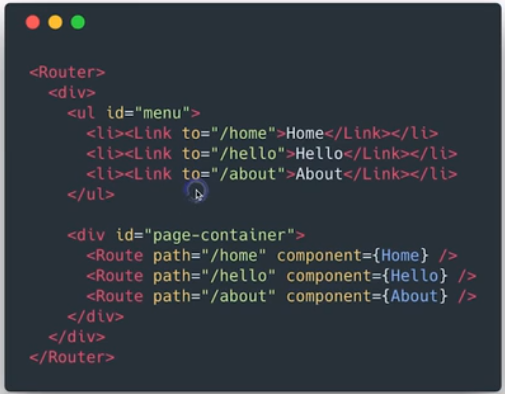

# react-router

## 为什么需要路由

1. 单页应用需要进行页面切换
2. 通过 URL 可以定位到页面
3. 更有语义的组织资源

## 路由实现的基本架构

> 路由由组件容器来定义，左边的导航栏和页面布局没有变化

> page-container 就是组件容器

## react-router 的特性

1. 声明式路由定义
2. 动态路由

## 路由实现方式

1. URL 路由-history API
2. hash 路由
3. 内存路由 (MemoryRouter) url 没有变化

## 基于路由配置进行资源组织

1. 实现业务逻辑的松耦合
2. 易于扩展，重构和维护
3. 路由层面实现 Lazy load

## React Router API

1. `<Link>` 普通链接，不会触发浏览器刷新
2. `<NavLink>` 类似 Link 但是会添加到当前选中状态
3. `<Prompt>` 满足条件时提示用户是否离开当前页面
4. `<Redirect>` 重定向当前页面，例如登录判断
5. `<Route>` 路由配置的核心标记，路径匹配时显示对应组件
6. `<Swith>` 只显示第一个匹配的路由

## 通过 URL 传递参数

1. URL 传递参数：`<Route path="/topic/:id" .../>`
2. 获取参数：`this.props.match.params`

## 嵌套路由

1. 每个 React 组件都可以是路由容器
2. React Router 的声明式语法可以方便的定义嵌套路由
