# React

## Introduction React

### What React

> 2013年，Facebook 开发的函数式编程，用于创建**可复用，可聚合** web 组件 **UI 库**。仅提供前端 MVC(M:接口数据，C:React封装好了) 框架中的 **V 层**，并不是完整的 MVC 框架

### React History

简单功能一下出现BUG


- 问题出现的根源
  - **传统UI操作关注太多细节** (DOM API)
  - **应用程序状态分散在各处，难以追踪和维护**

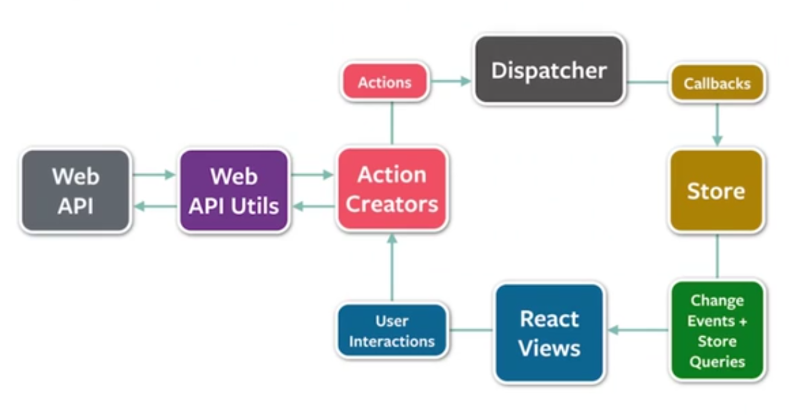

- 2013-6, Facebook 官方发布
- 2014-9, React 热度开始上涨
- 2015-3, React Native 发布

### Why use React

> 构建数据不断变化的大型应用

- **数据**变换
- 大量 **DOM** 操作
- **逻辑**极其复杂
- React 自动 DOM 操作
- React 状态对应内容（状态<=>数据）

### React 版本

- `React Fiber`(React 16 RC) 核心代码重写的版本，整体 API 变化不大
  - 主要变更了错误处理、生命周期、打包、对开发影响不是特别大
- `# npm install --save react@next react-dom@next`

### React 相关资源

- [awesome-react](https://github.com/enaqx/awesome-react)
- [babeljs](https://babeljs.io/)
- [兼容性](http://kangax.github.io/compat-table/es5/)
- [cdnjs.com](https://cdnjs.com/libraries/react/)
- [cdnjs.net](https://cdnjs.com/libraries/react/)
- [UNPKG](https://unpkg.com/)
- [NPMJS](https://www.npmjs.com/)
- [淘宝NPM镜像](https://npm.taobao.org)

### react生态圈

1. JSX：扩展的JS，React强依赖
2. Flux
3. Redux
4. React-Native：开发移动应用
5. React-Server

## 前段框架对比

### MVC

> Model View Controller

- Model(模型)：数据保存
- View(视图)：用户界面
- Controller(控制器)：业务逻辑


1. View 传送指令到 Controller
2. Controller 完成业务逻辑后，要求 Model 改变状态
3. Model 将新的数据发送到 View, 用户得到反馈

注意以上通信都是**单向的**

#### MVC 互动模式

1. View 接受指令，传递给 Controller


2. Controller 接受指令，传递给 Model保存，并在 View 层展现


**Backbne.js 实例**


1. 用户可以向 View 发送指令（DOM 事件），再由 View 直接要求 Model 改变状态。

2. 用户也可以直接向 Controller 发送指令（改变 URL 触发 hashChange 事件），再由 Controller 发送给 View。

3. Controller 非常薄，只起到路由的作用，而 View 非常厚，业务逻辑都部署在 View。所以，Backbone 索性取消了 Controller，只保留一个 Router（路由器）。

### MVP

> MVP 模式将 Controller 改名为 Presenter，同时改变了通信方向。


1. 各部分之间的通信，都是**双向**的。

2. View 与 Model 不发生联系，都通过 Presenter 传递

3. View 非常薄，不部署任何业务逻辑，称为"被动视图"（Passive View），即没有任何主动性，而 Presenter非常厚，所有逻辑都部署在那里。

### MVVM

> Model View ViewModel


- `MVVM` 模式将 `Presenter` 改名为 `ViewModel`，基本上与 MVP 模式完全一致。
- 唯一的区别是，它采用双向绑定（data-binding）：`View`的变动，自动反映在 `ViewModel`，反之亦然。`Angular` 和 `Ember` 都采用这种模式。

## React features

### ES6

> 全部使用 `ES6` 语法(上线时基于`Babel`工具`ES6`编译成`ES5`)

### 组件化

> 一切皆组件，提高代码**复用率、降低测试难度和代码复杂度**

- 提高代码复用率：组件将**数据和逻辑封装**，类似面向对象中的类
- 降低测试难度：组件**高内聚低耦合**，很容易对单个组件进行测试
- 降低代码复杂度：直观的语法可以解答提高可读性

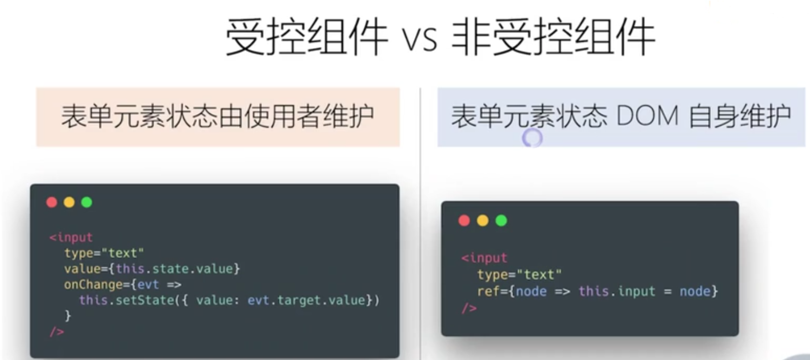

- 受控组件：状态来自于外部
- 非受控组件：状态来自于内部，外部要用的时候，使用其他方式拿到他的值（不需要`change`事件），但是外界需要知道`DOM`元素(ref)才能

#### 何时创建组件：单一职责原则

1. 每个组件只做一件事
2. 如果组件变得复杂，那么应该拆分成小组件

#### 数据状态管理: DRY 原则

1. 能计算得到的状态就不要单独存储
2. 组件尽量无状态，所需数据通过 `props` 获取

### 编码方式

- 编程式实现：需要以具体代码在哪里（where）做什么（what），如何实现（How）
- 声明式实现：只需要声明在哪里(where)做什么（what），而无需关系如何实现（how）

### JSX

> 不是模板语言，只是一种语法糖。JS 逻辑与 HTMl 标签紧密相连并且极易理解 XML 语法扩展。JavaSript XML 语法标记

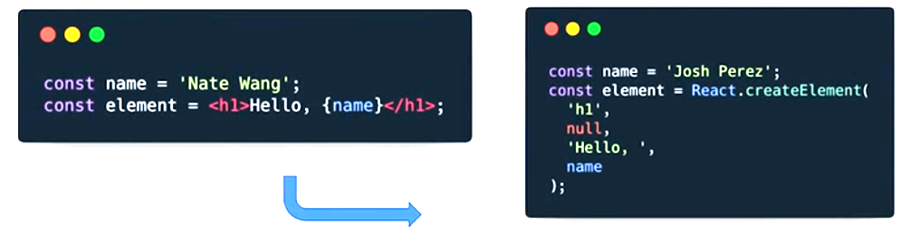

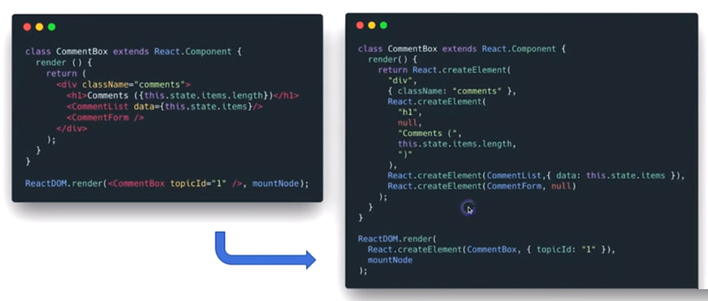

JSX 的本质：动态创建组件的语法糖

- 相比 `JS` 输出 `html` 标记需要字符串并连接符进行输出
- `JSX` 可以**自定义标签**
- `JSX` 定义组件名必须以**大写字母开头**，小写字母开头是HTML标记
- `JSX` 语法规定**最外层标签**必须有且**只有一个标记**。也可以`Fragment`标记作为片**段标记**
- `JSX` 标记可以直接使用属性语法，例如`<Menu.Item />`

#### JSX 中使用表达式

1. JSX 本身是表达式: `const element = <h1>Hello, world!</h1>`
2. 在属性中使用表达式：`<MyComponent foo={1 + 2 + 3 + 4} />`
3. 延展属性:

```jsx
const props = {firstName: 'Ben', lastName: 'Hector'}
const greeting = <Greeting {...props} />
```

4. 表达式作为子元素: `const element = <li>{props.message}</li>`

#### JSX 优点

1. 声明式创建界面的直观
2. 代码动态创建界面的灵活
3. 无需学习新的模板语言

### 单向数据流

> 数据一旦更新，就直接重新渲染整个 app

### 虚拟 DOM 树

#### Virtual DOM 的工作原理

> React组件内部有虚拟DOM状态，这种DOM状态最终会映射到真实的DOM节点上，但是真实DOM发生变化的时候，它内部需要计算与虚拟DOM之间的区别来产生diff，最终真实的DOM不会把整体更新DOM，而是把diff部分以一种更搞笑的方式更新到UI上，从而能够保证性能

#### 虚拟DOM是如何工作的

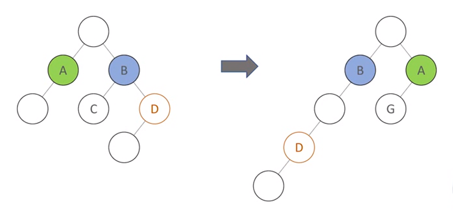

算法：O(n) 复杂度

#### 广度优先分层比较

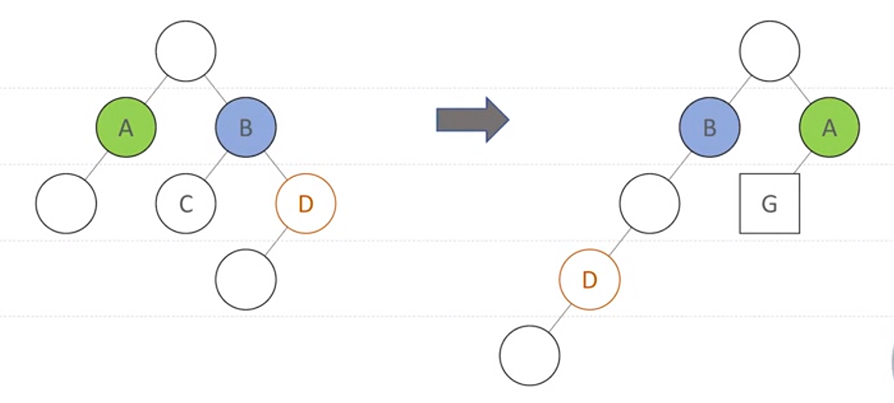

1. A与B节点互换位置
2. D节点放到B节点的子节点下面
3. A节点本来是原型类型，现在变成组件类型

#### Virutal DOM 如何计算 diff

1. 根节点开始比较，没有变化，不做任何的修改
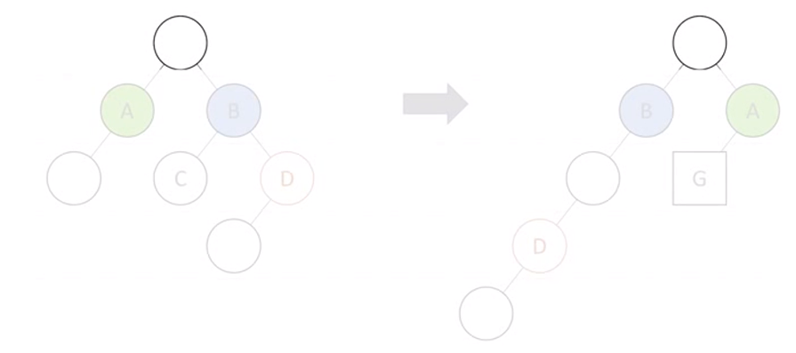

2. 属性变化及顺序(key属性的作用)：两个节点的顺序发生了变化，顺序改变一下就可以了。但是，由于程序需要知道两个节点的标识，A和B必须有唯一的标识，这样才能知道两个节点之间的变化，在这一层算法是交换两个节点的位置
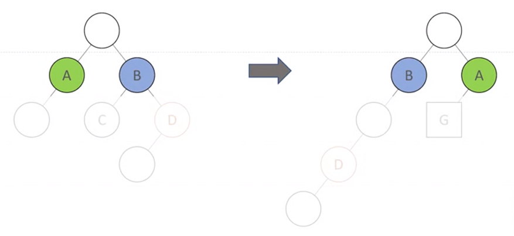

3. 节点类型发送变化
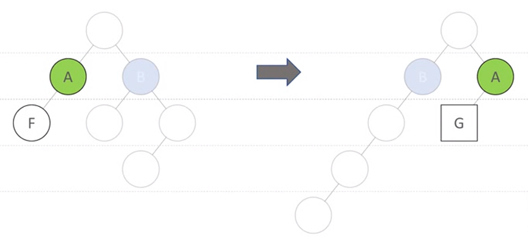

F节点编程G节点，React会删除F节点，创建G节点。它不管F节点是否应用到其他节点上。

4. 节点跨层移动

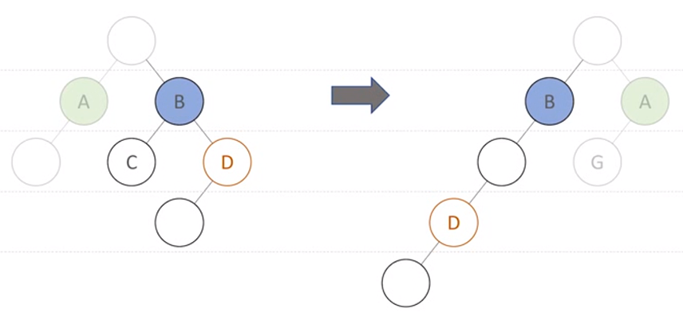

删除原来B节点下的所有子节点，在新的B节点下创建子节点及子子几点。React在跨层移动相对**性能比较低**。

#### Vitual DOM 的两个假设

1. 组件的 DOM 结构是相对稳定的(跨层移动)
2. 类型相同的兄弟节点可以被唯一标识(`key`属性)

[Virtual DOM 案例](https://supnate.github.io/react-dom-diff/index.html)

- React 重建 DOM 树
- 找到与上个版本的 DOM 的差异
- 计算出最新的 DOM 更新操作
- 从操作队伍中批量地执行 DOM 更新操作

- 在 `Node.js` 服务器端运行
  - 服务器与客户端共用逻辑（lsomorphic javascript）
  - `SEO` 友好，便于生成缓存的单面应用
  - 直接渲染特定的页面而不用渲染整个 app

- 管理 `UI` 状态并不简单
  - 修改 `DOM` 树
  - 修改数据
  - 接收用户的输入
  - 异步 `API` 数据请求

1. `state` 数据
2. `JSX` 模板(`render`函数)
3. 数据 + 模板 结合，生成真实的 `DOM` 来显示
4. `state` 发生改变
5. 数据 + 模板 结合，生成真实的 `DOM`，替换原始的 `DOM`

- 缺陷：
  - 第一次生成了一个完整的 `DOM` 片段
  - 第二次生成了一个完整的 `DOM` 片段
  - 第二次的 `DOM` 替换第一次的 `DOM`，非常耗性能

1. `state` 数据
2. `JSX` 模板
3. 数据 + 模板 结合，生成真实的 `DOM` 来显示
4. `state` 发生改变
5. 数据 + 模板 结合，生成真实的 `DOM`，并不直接替换原始的 `DOM`
6. 新的 DOM(DocumentFragment) 和原始的 `DOM` 做比对，找差异
7. 找出 `input` 框发生了变化
8. 只用新的 `DOM` 中的 `input` 元素，替换掉老的 `DOM` 中的 `input` 元素

缺陷：系能的提升并不明显

1. `state` 数据
2. JSX 模板
3. 数据 + 模板 结合生成虚拟 `DOM` (虚拟DOM就是一个 JS 对象，用它来描述真实 DOM)（损耗了性能）
  `['div', {id:'abc'}, ['span',{}, 'hello world']]`
4. 用虚拟DOM的结构生成真实的 DOM 来显示
  `<div><span id='abc'>hello world</span></div>`
5. state 发生变化

6. 数据 + 模板 生成新的虚拟DOM (极大提升了性能)
  `['div', {id:'abc'}, ['span',{}, 'bye bye']]`

7. 比较原始虚拟DOM和新的虚拟DOM的区别，找到区别是span中的内容

8. 直接操作DOM，改变 span 中的内容

JSX -> createElement -> 虚拟DOM(JS 对象) -> 真实的 DOM

`<div><span>item</span></div>` = `return React.createElement('div', {}, React.createElement('div', {}, 'item'));`

`return React.createElement('div', {}, React.createElement('div', {}, 'item'));` 底层创建虚拟DOM

### 虚拟优点

1. 性能提升了
2. 跨端应用得以实现 - `React Native`。虚拟DOM生成原生组件

### 虚拟 DOM 的 diff 算法


`setState` 异步函数，连续三次`setState`，合并成一次`setState`

同级比较

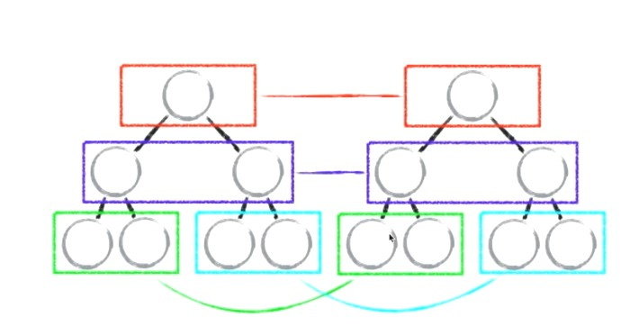

第一级别比较不同，不再继续比较。第一级别重新生成新的 `DOM` 节点树，替换原始节点树。缺点：其他级别相同 `DOM` 比较也会创建新的 `DOM`，但是比比较每个节点的算法性能更好。

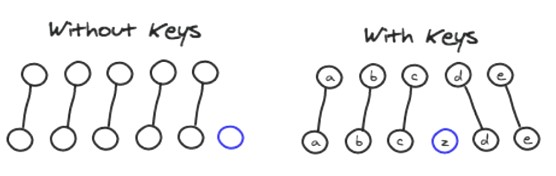

每个节点起个名字，这样比对时性能提升。如果一致可以进行复用。

`index` 作为 `key` 不好的原因是，删除其中某个节点之后 `index` 会重新排序，这样原始节点的`key`与新节点没有对应关系，所以`diff`算法比较性能更差。一定不要使用`index`作为`key`。

使用稳定值得作为`key`值才是正确的。

## 渲染方式

- 传统方式
  - 浏览器请求页面
  - 服务器请求数据库
  - 将数据传给模板
  - 模板渲染页面
- React 的渲染方式
  - 用户输入
  - 从 API 获取数据
  - 将数据传给顶层组件
  - React 将每个组件渲染出来

## yarn

> 新一代包管理工具

### yarn 特性

- 速度快
- 安装版本统一、更安全
- 更简洁的输出
- 更好的语义化

### 如何使用 yarn

- `yarn init`
- `yarn add`
- `yarn remove`
- `yarn / yarn install` 安装依赖包

## 脚手架

- vue 脚手架: `vue-cli`
- react 脚手架
  - `create-react-cli` 入门
  - Codesandbox 在线
  - Rekit 大型项目

### 为什么需要脚手架工具

- React
- Redux
- React/Router
- Babel
- Webpack
- ESLint

### Rekit

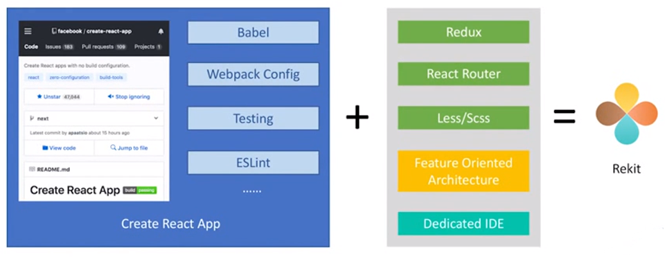

### Online: Codesandbox.io

> 可以在线打包

### create-react-cli

- 全局环境安装模块: `npm i -g create-react-app`
- 查看全局安装模块目录：`npm root -g`
- 查看模块八本：`create-react-app --version`

### 使用脚手架创建项目

> 项目命名规则：小写字母、数字和特殊字符(横线和下划线)

```sh
create-react-app my-app
```

### 项目结构

- **node_modules** 当前项目中依赖的包
- **.bin** 本地项目可执行命令，在package.json的 scripts 中配置对应的脚本即可
  - `react-scripts`
- **public** 当前项目的HTML页面(单页面应用放一个index.html即可，多页面根据自己需求放置需要的页面)
  - `index.html`
    - 所有的逻辑都在JS中完成（包括页面结构的创建），如果给当前的页面导入CSS样式或者ImG图片等内容
      - 1.JS中基于 ES6 Module模块规范，使用 `import` 导入，这样 webpack在编译合并JS的时候，会把导入的资源文件等插入到页面的结构中（**绝对不能再JS管控的结构中通过相对目录**。例如：`./`或者`../` 导入资源，因为在 webpack 编译的时候，地址就不在是之前的相对地址）
      - 2.不在JS中导入（JS中导入的资源最后都会基于Webpack编译），可以把资源手动的在HTML中导入，但是HTML最后也要基于Webpack编译，导入的地址也**不建议相对地址**，而是使用 `%PUBLIC_URL%` 写成绝对地址
        - `%PUBLIC_URL%` 等于 `public`目录
- **src** 组件、路由、CSS和图片源码目录
  - `index.js` 当前项目的主入口文件
- **.gitignore** git提交过程中忽略的文件或目录
- **package.json** 当前项目配置清单
  - **dependencies** 生产环境模块依赖
    - `react`
    - `react-dom`
    - `react-scripts` **集成了webpack等需要的内容**
      - Babel
      - CSS
      - ESlint
      - webpack
      - 没有 less/sass处理内容(需要时，自己额外的安装)
  - **devDependencies** 开发依赖模块
  - **scripts**
    - `start`： 开发环境下，基于 webpack 编译处理，最后可以预览当前开发项目成果（在webpack中安装了`webpack-dev-server`插件，基于这个插件会自动创建一个Web服务【端口号】默认是`3000`，webpack会自动打开浏览器并展示给我们，并且监听代码变化，自动重新编译，并且刷新浏览器来完成重新渲染）
    - `build`: 项目需要部署到服务器上，先执行 `yarn build`，把项目整体打包（完成后会在项目中生成一个build目录，这个目录中包含了所有编译后的内容，把这个上传到服务器即可）；而且在服务器上进行部署的时候，不需要安装任何模块（Webpack已经打包编译了）
  - **eject**

### 项目开发流程

1. `reset.css` 重置样式文件存放到 `public/css` 目录下；打开 `public/index.html` 文件在`head`标签中插入如下代码`<link rel="stylesheet" href="%PUBLIC_URL%/css/reset.min.css">`；此处必须webpack编译之后打开页面生效

### 脚手架深入剖析

- `create-react-app` 脚手架把安装的`webpack`及配置文件集成在`react-script`模块中，放到了`node_modules`目录中
- 生产环境项目中，需要在脚手架默认安装的基础上，额外安装一些其他需要的模块，例如：`react-router-dom/axios/less/less-loader`
  - 情况一(`react-router-dom/axios`)：我们安装其他的组件，但是安装成功后不需要修改webapck的配置项，此时直接的安装，并且调取使用即可。
    - 举例：
      `yarn add qs` 之后`"dependencies": {"qs": "^6.7.0"`
      - src/index.js 中导入`qs`
        - `import qs from 'qs'`
        - `console.log(qs.parse('name=wovert&age=10&type=teacher'))`
  - 情况二(`less/less-loader`)：安装的插件基于webpack处理的，也就是需要把安装的模块配置到webpack中（重新修改webapck配置项）
    - (1) 首先需要把隐藏的`node_modules`中的配置项暴露到项目中
      - `yarn eject` 指向之后不可逆
        - 1)首先确认执行eject操作，这个操作不可逆，一旦暴露出来配置项，就无法再隐藏回去
        - 2)当前的项目 **git** 管理，在执行`eject`的时候，没有提交到历史去的内容，需要先提交到历史区，然后再 `eject` 才可以，否则报错
    - (2) 再次修改对应的配置项即可
      - 暴露后，项目目录多个两个目录
        - **config** webpack配置文件
          - **webpack.config.dev.js** 开发环境下的配置项(`yarn start`)
          - **webpack.config.prod.js** 生产环境下的配置项(`yarn build`)
        - **scripts** 可执行脚本的JS文件
          - **start.js** `yarn start` 执行的就是这个JS
          - **build.js** `yarn build` 执行的就是这个JS
        - **package.json** 中的内容修改
    - 举例：
      - (1) `vim src/static/less/index.less`
        - `@color: lightblue;`
        - `html, body { height: 100%; overflow: hidden; background:@color}`
      - (2) `vim src/index.js`
        - `import from './static/less/index.less`
      - (3) 预览项目的时候，也是先基于webpack编译，把编译后的内容放到浏览器中运行，所以项目中使用**less**，需要修改webpack配置项，在配置项中加入less的编译工作，这样后期预览项目，首先基于**webpack把less编译为css**，然后在呈现在页面中
        - 1)`yarn add less less-loader`
        - 2)`less`在开发和生产环境都需要配置的
          - `vim config/webpack.config.js`

```js
const lessRegex = /\.less$/
const lessModuleRegex = /\.module\.less$/
{
  test: lessRegex,
  exclude: lessModuleRegex,
  use: getStyleLoaders(
    {
      importLoaders: 2,
      sourceMap: isEnvProduction && shouldUseSourceMap,
    },
    'less-loader'
  ),
  sideEffects: true
},
{
  test: lessModuleRegex,
  use: getStyleLoaders(
    {
      importLoaders: 2,
      sourceMap: isEnvProduction && shouldUseSourceMap,
      modules: true,
      getLocalIdent: getCSSModuleLocalIdent
    },
    'less-loader'
  )
}
```

`set HTTPS=true&&set PORT=3443&&yarn start` 开启https协议模式（设置环境变量HTTPS的值）

## 打包和部署

### 为什么需要打包

1. 编译ES6语法特性，编译JSX
2. 整合资源，例如图片，Less/Sass/Stylus
3. 优化代码体积

### 打包注意事项

1. 设置 Node 环境为 production
2. 禁用开始时专用代码，比如 logger
3. 设置应用根路径

## react & react-dom

- **渐进式框架**：流行的框架设计思想，一般框架中包含很多内容，这样导致框架的体积过于臃肿，拖慢加载速度。实际项目中，我们使用一个框架，不一定用到所有的功能，此时应该把框架的功能进行拆分，用户想要什么，让其自己自由组合即可。
- 全家桶：渐进式框架N多部分的组合
- **VUE全家桶**：vue-cli/vue/vue-router/vuex/babel/webpack/axios(fetch)/vue element(vant)
- **REACT全家桶**：create-react-app/react/react-dom/react-router-dom/redux/react-redux/babel/webpack/axios/ant/dva/saga/mobx
  - **react**: react框架的核心部分，提供了Component类可以进行**组件开发**，提供**钩子函数**（生命周期函数：所有的声明周期函数都是基于回调函数完成的）
  - **react-dom**：把JSX语法渲染为真实DOM（能够放到页面中展示的结构都叫做真实的DOM）的组件
    - `ReactDOM.reander([JSX], [CONTAINER], [CALLBACK])` 把JSX元素渲染到页面中
      - JSX：React虚拟元素
      - CONTAINER：容器，想把元素放到页面中的那个容器中
      - CALLBACK: 当把内容放到页面中呈现触发的回调函数

## React 是如何使用 JSX

> JSX: React独有的语法，JavaScript+XML = JSX

- (1)不推荐把JSX直接方法哦body中，而是放在自己创建一个容器中，一般我们都放在一个ID为ROOT的div中即可 `ReactDOM.render(<div id="box">Hello {data}</div>), document.querySelector('#root'), ()=> { let oBox=document.querySelector('#box'); console.log(oBox.innerHTML)})`
- (2)JSX 中出现的`{}`是存放JS代码，但是要求JS代码执行完成需要有返回结果（JS表达式）
  - 不能直接放一个对象数据类型的值（`对象(除了给style赋值)`、`数组`（数组中没有对象都是基本值或者是JSX元素是可以的）、`函数`都不行）
  - 可以是基本数类型的值(`布尔类型`什么都不显示、`null`、`undefined`也是JSX元素，代表的是空)
  - 不支持循环判断语句，但是支持**三元运算符**
- (3)当前循环数组创建 JSX 元素（一般都是基于数组的`MAP`方法完成迭代），需要给创空的元素设置唯一的 `KEY` 值（当前本次循环内唯一即可）
- (4)只能出现一个根元素
- (5)给元素设置样式类用的是 `className` 而不是 `class`
- (6)`style`属性中不能直接写样式字符串，而是基于一个样式对象来遍历赋值

```js
let data = [
  {
    name: 'wovert',
    age: '10'
  },
  {
    name: 'lingyima',
    age: '18'
  }
]

export default class App extends Component {
  render() {
    return (
      <div className="App">
        <header className="App-header">
          boolean: {true}<br />
          null: {null}<br />
          undefined: {undefined}<br />
          {
            data.map((item, index) => {
              let {name, age} = item
              return <span key={age}>{name}</span>
            })
          }
          
          <p>
            Edit <code>src/App.js</code> and save to reload.
          </p>
        </header>
      </div>
    );
  }
}
```

``` js
<p className="hello">Hello {this.props.name}</p>
// 将编译成 React 构造器的方法
React.createElement("p", {className: "hello", "hello ", this.props.name})
```

## JSX 渲染机制

- (1) 基于babel中的语法解析模块**babel-preset-react** 把 JSX语法编译为 `React.createElement(...)` 结构
  - presets
    - state-0 提案(能不能成功不知道)
    - stage-1 审议(已经审核)
    - stage-2 草案(没有规范，但等于正式)
    - stage-3 正式发布
    - react
- (2) 执行`React.createElement(type, props, children)` 创建一个对象（虚拟DOM）
  - type: 'h1'
  - props: {id: '', className: '', style: '', children: ''}
  - ref: null
  - key: null
- (3) ReactDOM.render(JSX语法最后生成的对象，容器)，基于render方法把生成的对象动态创建为DOM圆度，插入到指定的容器中

## 声明组件

### 1. 函数式声明组件

```js
export function Toast () {
  return (
    <div>组件内容</div>
  )
}
```

### 2. 基于继承Component类来创建组件

> 基于create-element把JSX 转换为一个对象，当Render渲染这个对象的时候，遇到type是一个函数或者类，不是直接创建元素，而是先把方法执行

- 如果是函数式声明的组件，就把它当做普通方法执行（方法中的`this`是`undefined`），把函数返回的JSX元素（也是解析后的对象）进行渲染
- 如果是类声明式的组件，会把当前类`new`它执行，创建类的一个实例（当前本次调取的组件就是他的实例）

### JSX 语法代码

``` js
function hello(props){
  return <h1>Hello, {props.老大}</h1>
}
```

### JSX 转后的 JS代码

``` js
"use strict";
function hello(props) {
  return React.createElement(
    "h1",
    null,
    "hello, ",
    props.老大
  )
}
```

### JSX 基础语法

> View 层语法

- `js` 里直接写 `html`
- `class` 写成 `className`
- 变量用`{}`包裹即可

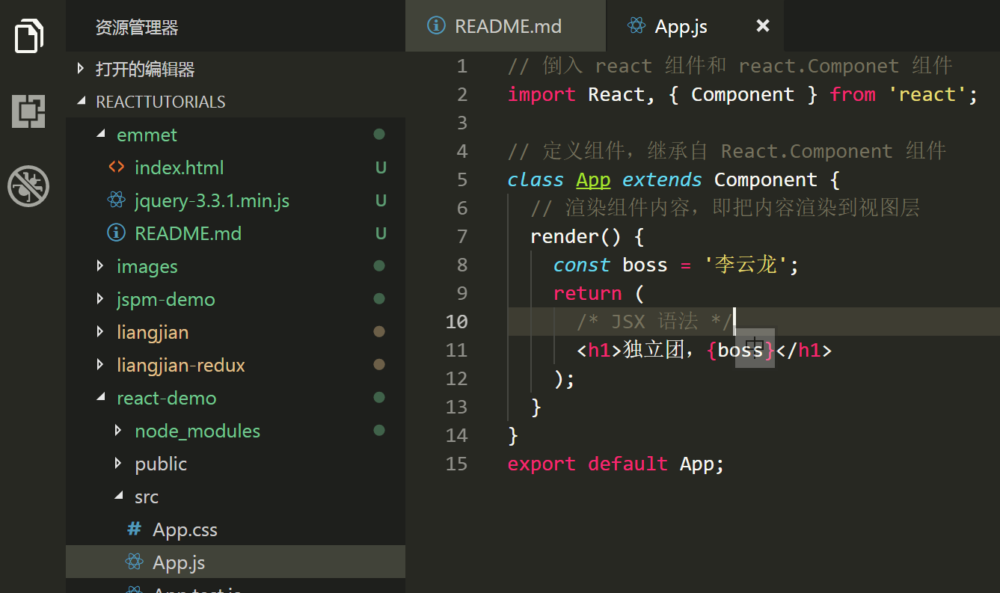

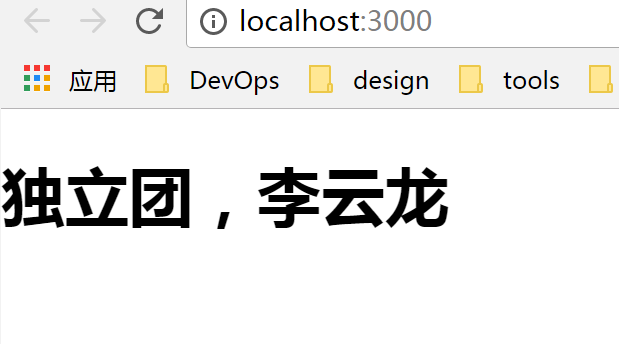

### 组件之间传递数据

> 组件之间用 props 传递数据

- 使用 `<Component data="values">` 的形式传递
- 组件里使用 `this.props` 获取值
- 如果组件只有 `render`函数，还可以用函数的形式写组件

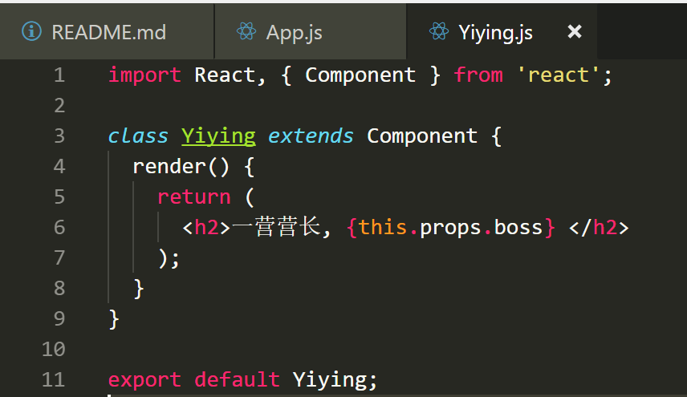

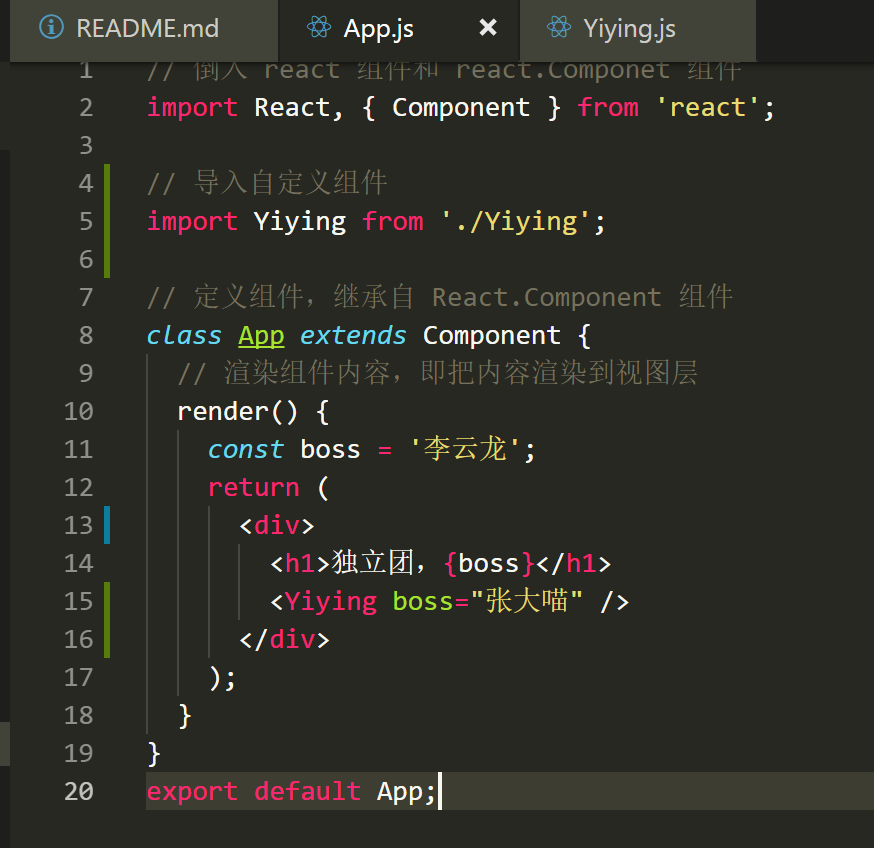

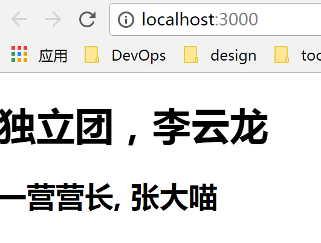

函数也可以作为组件

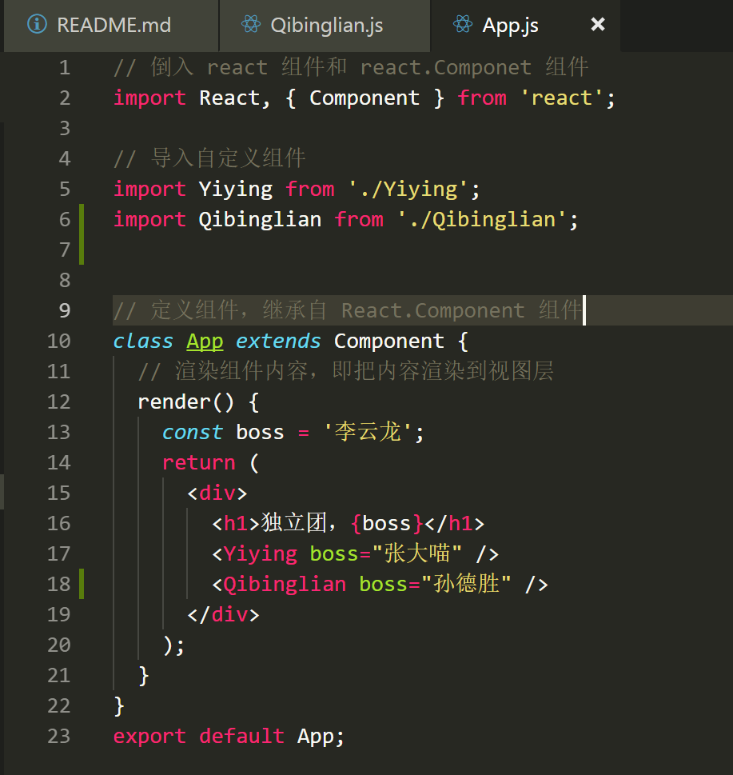

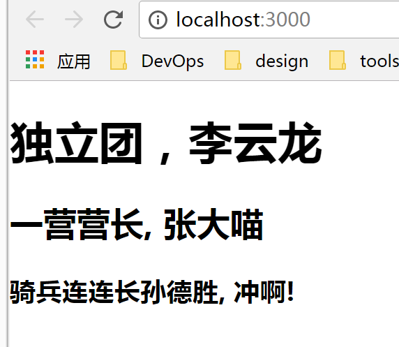

## 组件内部 state

> 组件内部通过 state 管理状态

- JSX 本质就是 js,所以直接`数组.map` 渲染列表
- `Constructor` 设置初始状态，记得执行`super(props)`
- State 是不可变得对象，使用 `this.state` 获取

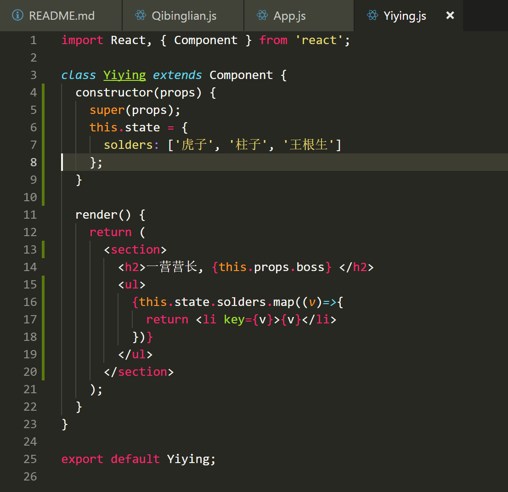
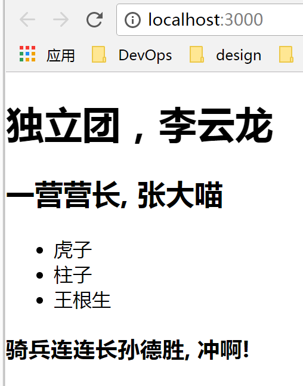

### 设计模式 - 高阶组件和函数作为子组件

#### 高阶组件（HoF）

> 高阶组件是对已有的组件进行封装形成新的组件，新的组件包含一些自己的应用逻辑，逻辑会产生新的状态，这个状态会传给已有的组件。一般高阶组件不会有自己的UI展现，只是为自己封装的组件提供额外的数据

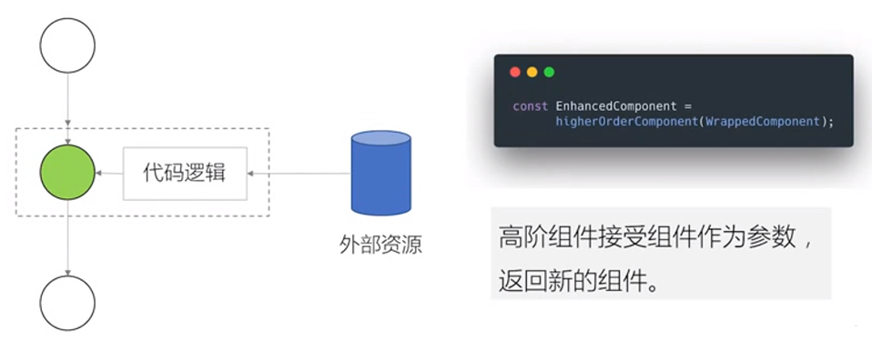

三个圈代表三个组件，UI都是组件树来描述的。绿色组件需要属性的时候，Parent组件向子组件传递所需属性，同样的绿色组件属相传给子组件。问题：所有的属性由父组件传给过来，父组件需要知道你的组件的所有状态，这时候相隔好几层组件的怎么传递？高阶组件可以解决这个问题。高阶组件自己获取外部资源，做业务处理之后封装组件。此时，这个组件属性来源有两处。一个是父组件，另一个是高阶组件。高阶组件接受组件作为参数，返回新的组件。

#### 函数作为子组件

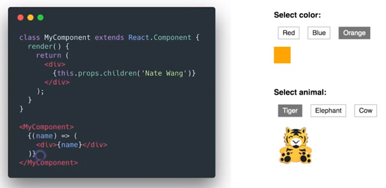

## Context API

> 解決组件间通信问题。全局的状态由多个组件共享状态。redux, React-router 依赖 Context API。React 16.3 开始可以使用 Context API

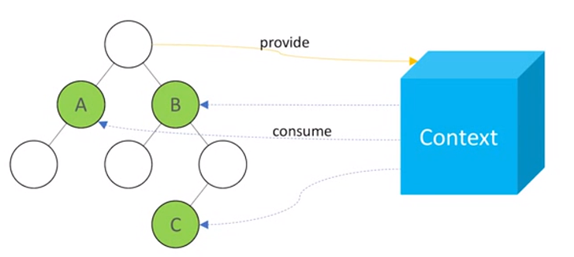

- 根节点：provide
- context api: consume

## 事件

### 响应式设计思想和事件绑定

绑定事件命名必须驼峰是命名

- onClick 点击事件
  - JSX 里，`onClck={this.函数名}`来绑定事件
  - this 引用问题，需要在`构造函数里用 bind 绑定 this`
  - `this.setState` 修改 state, 记得`返回新的 state`，而`不是修改`

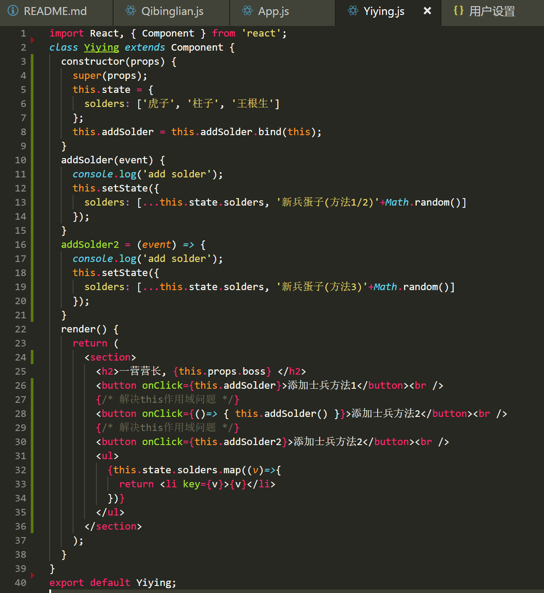

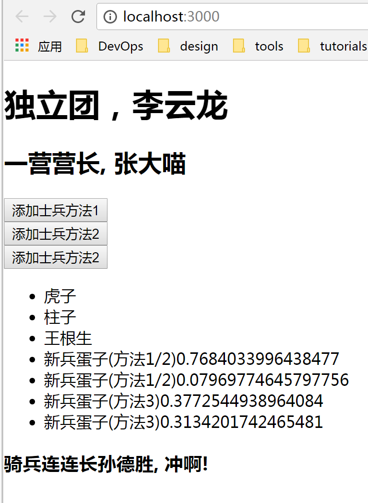

### immutable

> state 不许允做任何的改变，所以拷贝数据然后再赋值

### 拆分组件与组件之间的传值

- 父组件通过组件属性向子组件传递值，子组件通过`this.props.属性名`
- 子组件向父组件传递值
- key放在循环层的最外层

- 声明式开发
- 可以与其他框架共存
- 组件化
- 单项数据流
  - 父组件传递状态数据给子组件，子组件只能只读，不能写入。但是，可以在子组件中通过调用父组件方法修改父组件的状态数据
- 视图层框架(ReactJS)
- 函数式编程
- 数据框架层(Redux/Flusk)

### React developer tools 安装及使用

> Chrome 浏览器下载 React Developer Tools

### PropTypes VS DefaultProps

> 校验父组件传递的属性值

```js
import PropTypes from 'prop-types'

// 校验父组件传递的值
TodoItem.propTypes = {
  content: PropTypes.oneOfType([PropTypes.string, PropTypes.number]),
  deleteItem: PropTypes.func,
  index: PropTypes.number,
  name: PropTypes.string.isRequired
}

// 设置默认值
TodoItem.defaultProps = {
  name: 'default name'
}
```

### props，state与render函数的关系

React是数据驱动

当props和stats值改变的时候执行render函数

render函数重新获取新的值进行渲染

数据发生变化，页面就会发生变化

### 子组件重新渲染方式

> 当state或props值改变时，它的render函数会重新运行执行

1. 父组件传给子组件传递父组件state数据改变时，子组件render函数会运行
2. 当父组件的render 函数被运行时，它的子组件的render 函数都被重新运行一次

### ref属性

``` html
<ul ref={(ul) => { this.ul = ul }}>
  { this.getTodoItem() }
</ul>
```

```js
this.setState((prevState) => ({
  list: [...prevState.list, prevState.inputValue],
  inputValue: ''
}), () => {
  // setState异步执行完成之后执行以下代码
  console.log(this.ul.querySelectorAll('li').length)
})
console.log(this.ul.querySelectorAll('li').length) // 比预计的少一个，因为setState异步执行
```

## React 生命周期函数

> 某一时刻组件会自动调用执行的函数；在组件不同的状态执行

- 初始化周期
- 组件重新渲染生命周期
- 组件卸载声明周期

- getDefaultProps
- getInitalState
- componentWillMount
- render


- **Render Phase**: 纯净且没有副作用；可能会被Render暂停，终止或重新启动
- **Pre-commit Phase**: 可以读取DOM
- **Commit Phase**: 可是使用DOM，运行副作用，安排更新

- `constructor`
  - 1.用于初始化内部状态，很少使用
  - 2.唯一可以直接修改 state 的地方
- `getDerivedStateFromProps`: React 16.3 引入的API，它从外部的属性去初始化内部的状态
  - 1.当 `state` 需要从 `props` 初始化时使用
  - 2.不推荐使用：维护两个状态一致性会增加复杂度
    - `state` 需要从 `props` 获的，可以从`props`动态得到，不需要单独存储这个状态
    - 一旦单独存储，意味着始终维护两个状态，容易出现bugs
  - 3.每次 `render` 都会调用
  - 4.典型场景：**表单空间获取默认值**
- `render`: 描述UI DOM 结构，组件必须声明
- `compnentDidMount`: 可是发起接口请求，定义外部资源，可以运行副作用
  - 1.UI渲染完成后调用
  - 2.只执行一次
  - 3.典型场景：**获取外部资源**
- `componentWillUnmount`
  - 1.组件移除时被调用
  - 2.典型场景：资源释放
- `shouldComponentUpdate`: 组件是否需要渲染，可以做性能**优化操作**，即时`state`变化，但是 `UI` 不需要变化
  - 1.决定 `Virtual DOM` 是否要重绘
  - 2.一般可以由 `PureComponent` 自动实现
  - 3.典型场景：**性能优化**
- `getSnapshotBeforeUpdate`: React 16.3 引入的API
  - 1.在页面 `render` 之前调用，`state` 已更新
  - 2.典型场景：获取 `render` 之前的 `DOM` 状态
- `componentDidUpdate`
  - 1.每次 `UI` 更新时被调用
  - 2.典型场景：**页面需要根据 `props` 变化重新获取数据**; 文件详情页，根据id变化内容也变化

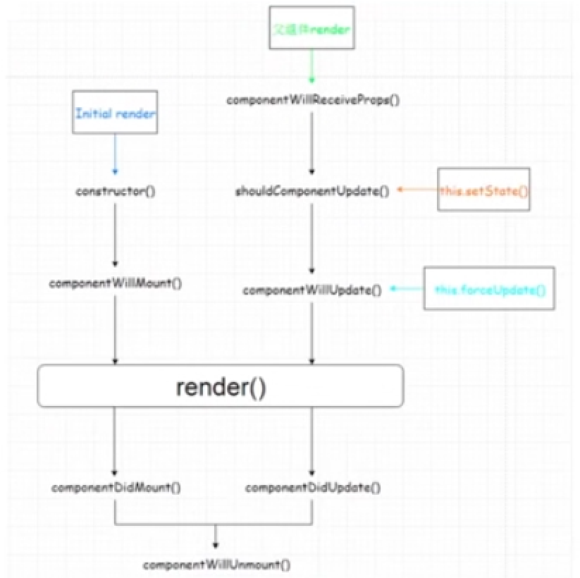

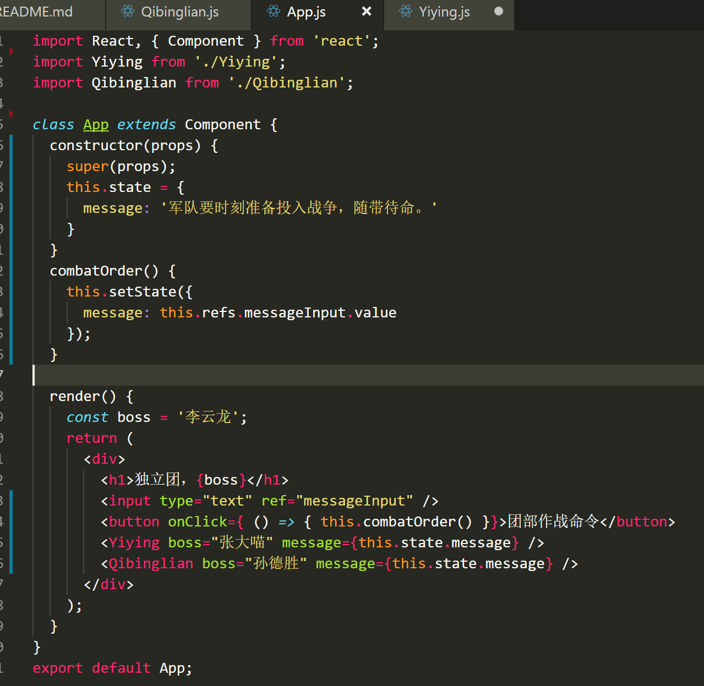

- 父组件: 输入命令并下达作战命令, `refs 属性`可以轻易获取　DOM　属性值

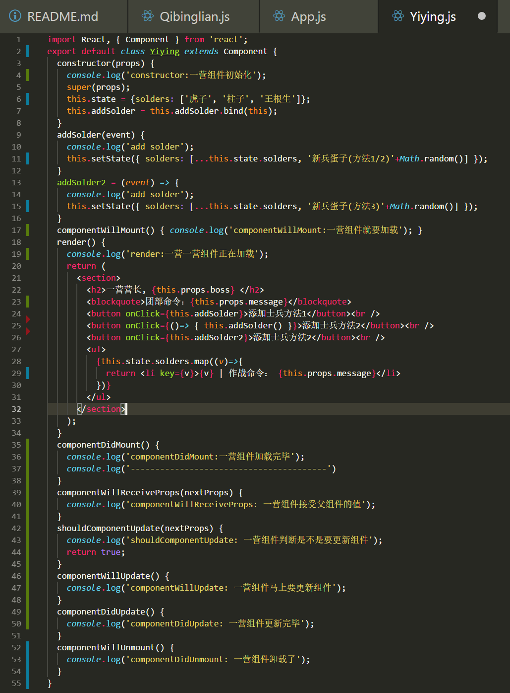

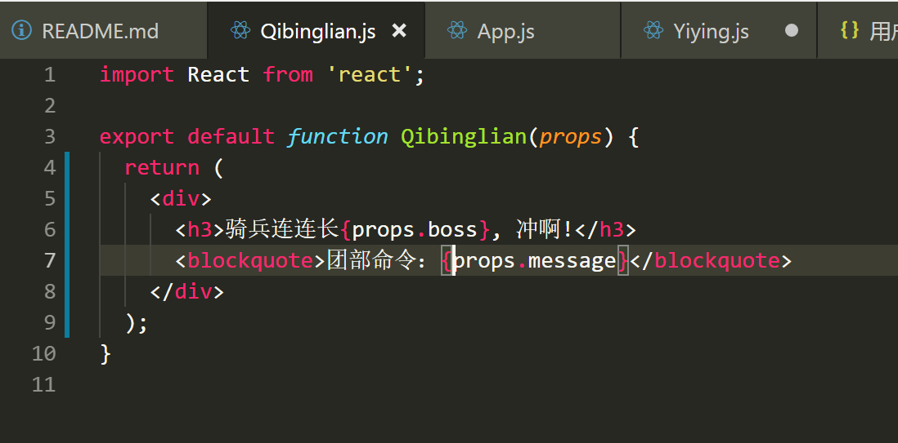

-------

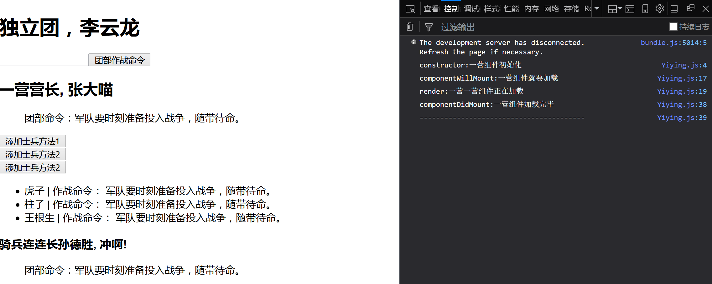

未下达命令之前：声明周期流程

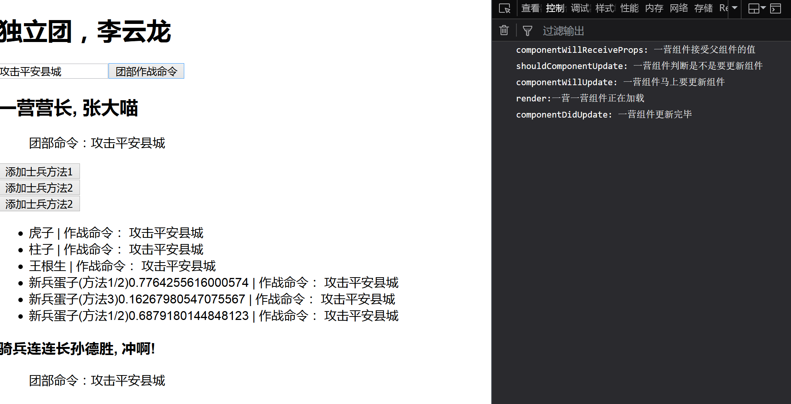

下达攻击平安县城命令之后：声明周期流程

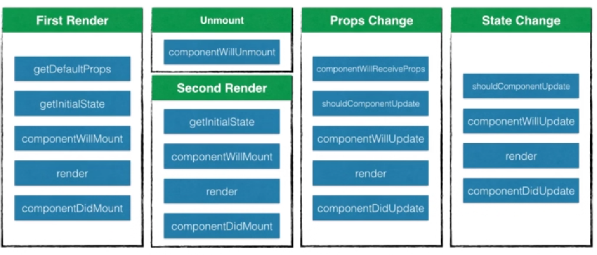

### 在某一时刻组件会自动调用执行函数

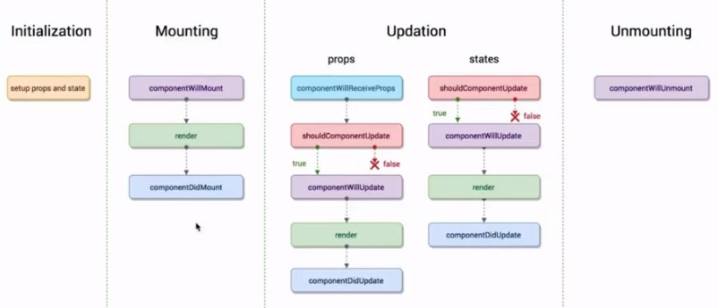

- **initalization**: 初始化时触发(`constructor(props){super(props) ... }`)
  - setup `props state`

- **Mounting**: 组件挂载时触发
  - `componentWillMount`: 组件即将被挂载到页面的之前仅自动执行**一次**(挂载之前)
  - `render`: 渲染组件
  - `componentDidMount`: 组件被挂载到页面之后仅自动被执行**一次**(已经挂载)

- **Updation**: 组件更被时触发
  - **props** (props发生变化)
    - `componentWillReceiveProps`
      - 一个组件要从父组件接受参数
      - 只要父组件的render函数被重新执行了，子组件的这个生命周期函数就会被执行
        - 如果这个组件第一次存在于父组件中，不会执行
        - 如果这个组件之前已经存在于父组件中，才会执行

    - `shouldComponentUpdate`: 组件被更新之前，它会自动被执行。必须返回boolean是否继续往下执行其他事件。
      - `return false` 组件不会被更新
      - `return true` 组件会被更新

    - `componentWillUpdate`: 组件被更新之前，自动执行
      - `shouldComponentUpdate`: 返回 `false`, `componentWillUpdate` 不会被执行
      - `shouldComponentUpdate`: 返回 `true`, `componentWillUpdate` 会被执行
    - `render`: 更新渲染组件
    - `componentDidUpdate`: 组件被更新之后，自动执行
  
  - **states** (states发生变化)
    - `shouldComponentUpdate` (`true`向下)
    - `componentWillUpdate`
    - `render`
    - `componentDidUpdate`

- **Unmounting**
  - `componentWillUnmount`: 当这个组件即将被页面中移除的时候，会被执行

注意：render函数必须存在

### React 优化

1. 作用域绑定函数

`this.handleBtnClick = this.handleBtnClick.bind(this)`

2. `setState()` 异步处理机制：多次处理改成一次来做，降低 DOM 操作频次

3. 虚拟 DOM 比对速度

4. 子组件判断内容渲染

```js
shouldComponentUpdate (nextProps, nextState) {
  if (nextProps.content !== this.props.content) {
    return true
  } else {
    return false
  }
}
```

## Ajax 请求

```sh
# yarn add axios
# vim TodoList.js
  import axios from 'axios'

```

```js
// 组件挂载（只有一次执行）之后请求ajax
componentDidMount () {
  axios.get('/api/todolist')
    .then(() => {alert('success')})
    .catch(() => {alert('error')})
}
```

## [react-transition-group](https://reactcommunity.org/react-transition-group/) 动画

```js
import { CSSTransition } from 'react-transition-gruop'
```

## antd-mobile 组件

`# npm i antd-mobile@next --save`

### 按需加载组件代码和样式，修改主题

```sh
# yarn add babel-plugin-import --dev
# vim config/webpack.config.js
if (preProcessor) {
  if (preProcessor === 'less-loader') { // 为less-loader添加配置项，启动javascript
    loaders.push({
      loader: require.resolve(preProcessor),
      options: {
        sourceMap: isEnvProduction && shouldUseSourceMap,
        modifyVars: { // 修稿主题颜色
          'primary-color': '#f9c700',
        },
        javascriptEnabled: true // 解决上文报错
      },
    });
  } else {
    loaders.push({
      loader: require.resolve(preProcessor),
      options: {
        sourceMap: isEnvProduction && shouldUseSourceMap,
      },
    });
  }
}

{
  test: /\.(js|mjs|jsx|ts|tsx)$/,
  include: paths.appSrc,
  loader: require.resolve('babel-loader'),
  options: {
    customize: require.resolve(
      'babel-preset-react-app/webpack-overrides'
    ),
    plugins: [
      [
        ...
      ],
      [
        'import',
        {
          libraryName: 'antd',
          style: true // true 会加载 less 文件
        }
      ]
    ],
  },
},

```

或

``` sh
# vim package.json
  "babel": {
    "presets": [
      "react-app"
    ],
   "plugins": [
     ["import", { "libraryName": "antd-mobile", "style": "css" }]
  ]
}
```

``` js
// 隐藏导入样式文件
// import 'antd-mobile/dist/antd-mobile.css'
```

## 案例-亮剑

``` sh
# npm i -g create-react-app
# create-react-app -v
# create-react-app liangjian
# cd liangjian && npm start
```

### 独立团项目

- 独立团逐渐发展，老李发现管不过来了
  - 人少的时候，无论是兵器还是人员的变更，都是`setState`
  - 发展为千人大团后，老李决定，军事生活分开
  - 所有状态归赵政委(redux)管理，自己只打仗（view显示）

- 老赵主要功能
  - 老赵有一个保险箱(store)所有人的状态，在那里都有记录(state)
  - 需要改变的时候，需要告诉专员(dispatch)要干什么(action)
  - 处理变化的人（reducer）拿到 state 和 action ,生成新的记录（state）

### 走马上任

1. 首先通过 reducer 新建 store, 随时通过 store.getState 获取状态
2. 需要状态变更，store.dispatch(action) 来修改状态
3. Reducer 函数接受state和action，返回新的state, 可以用 store.subscribe 监听每次修改

### 安装 redux

``` sh
# npm install redux -S
# vim src/index.js
```

```js
import { createStore } from 'redux';
// 2. 根据老的state 和 action 生成新的state
function counter($state = 0, action) {
  switch(action.type) {
    case '加机关枪':
      return state + 1;
     case '减机关枪':
       return state - 1;
    default:
      return 10;
  }
}

// 1. 新建 store
const store = createStore(counter);

// 3. 获取状态
const init = store.getState();
console.log(init);
function listener() {
  const current = store.getState();
  console.log(`现在有机枪${current}`);
}
// 4. 订阅 listener - 每次dispatch都会触发listener
store.subscribe(listener);

// 5. 派发事件,传递 action
store.dispatch({type: '加机关枪'});
store.dispatch({type: '加机关枪'});
store.dispatch({type: '减机关枪'});
```

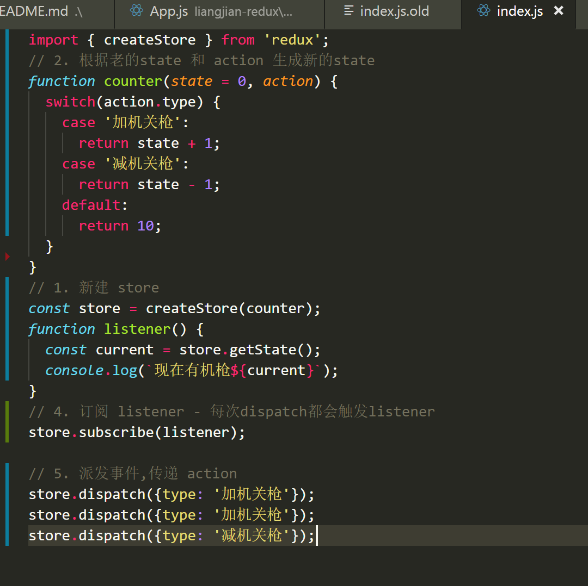

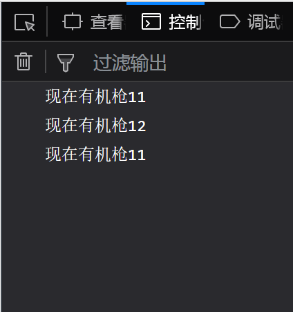

### Redux 如何和 React 一起用

- 手动连接，老赵怎么管理独立团
  - 把 store.dispath 方法传递给组件，内部可以调用修改状态
  - Subscribe 订阅 render 函数，每次修改都重新渲染
  - Redux 相关内容，移到单独的文件 index.redux.js 单独管理

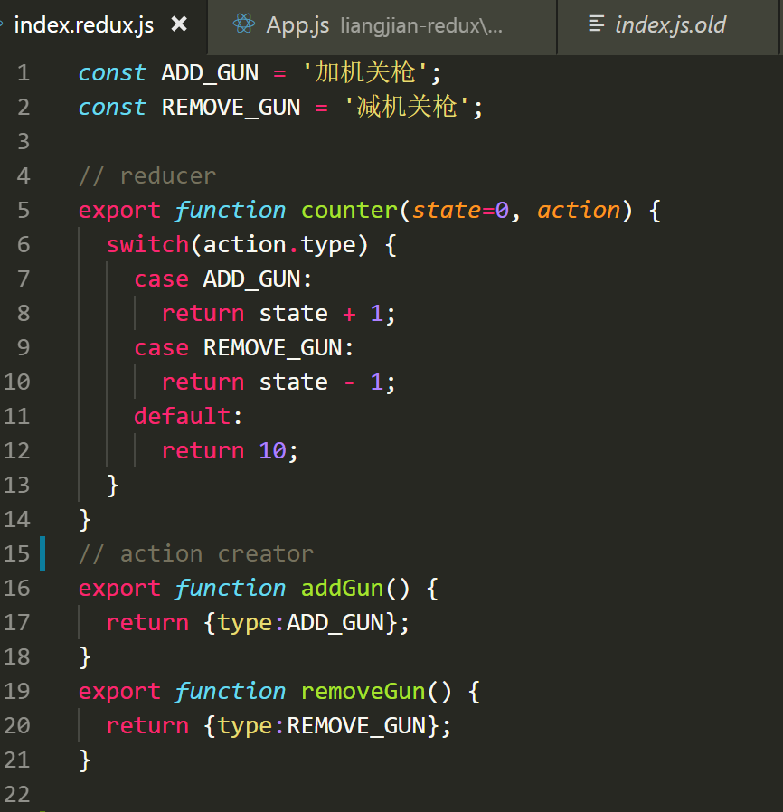

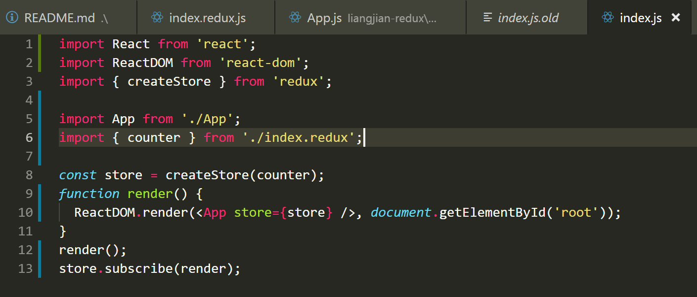


### 处理异步、调试工具、更优雅的和 React 结合

- Redux 处理异步，需要 `redux-thunk` 插件
- 安装调试工具 `npm install redux-devtools-extension` 并且开启
- 使用 `react-redux` 优雅的链接 react 和 redux

### redux-thunk 插件处理异步

``` sh
# npm i redux-thunk -S
# npm i redux-logger -S

使用 applyMiddleware 开启thunk中间件
Action 可以返回函数，使用 dispatch 提交 action

# npm i redux-devtools-extension -S
# npm i redux-chunk -S
```

index.js (applyMiddleware 处理中间件)

``` js
import { createStore, applyMiddleware} from 'redux'
const store = createStore(counter, applyMiddleware)
```

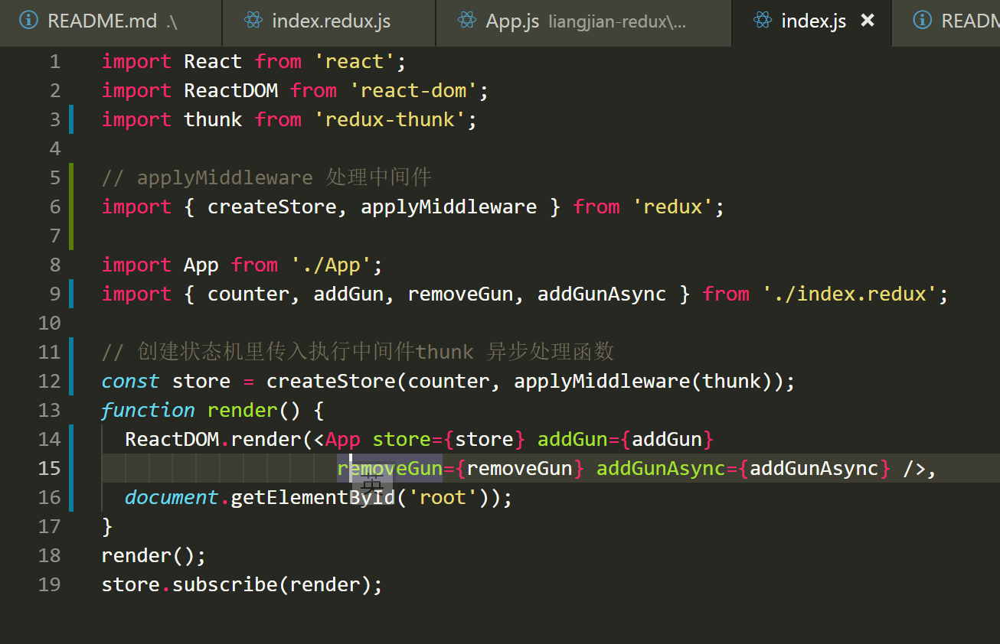

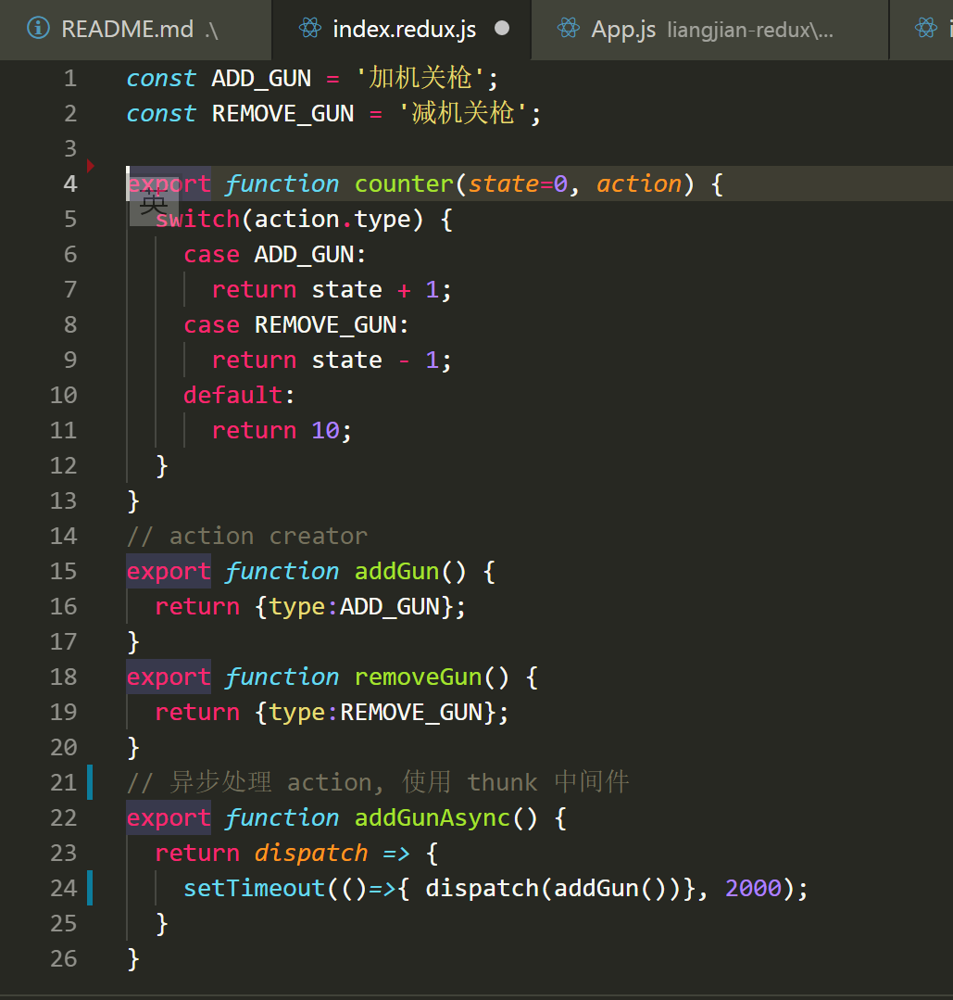

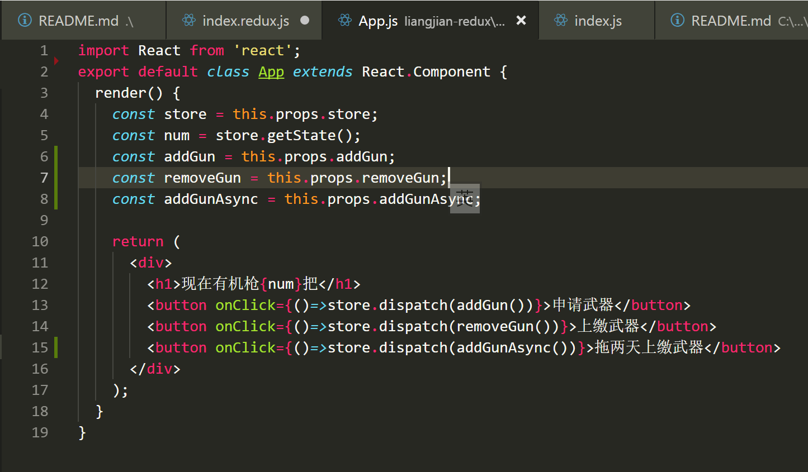

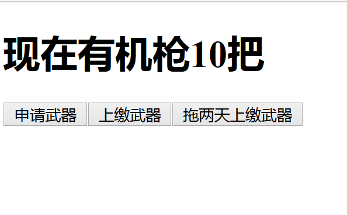

### 调试工具 redux-devtools-extension 配置

- 新建 `store` 的时候判断 `window.devToolsExtension`
- 使用 `compose` 结合 `thunk` 和 `window.devToolsExtension`
- 调试窗的 `redux` 选项卡，实时看到 `state`

``` js
import { createStore, applyMiddleware, compose } from 'redux';
const store = createStore(counter, compose(
  applyMiddleware(thunk),
  window.devToolsExtension ? window.devToolsExtension():f=>f;
))
```

### 使用 react-redux

- 老赵能力用起来很麻烦，为了方便管理，使用魏和尚来负责链接
- `npm i react-redux -S`
- 忘记 subscribe，记住reducer，action和dispatch 即可
- React-redux 提供 Provider 和 connect 两个接口来链接

- react-redux 具体使用
  - Provider 组件在应用最外层，传入 store 即可，只用一次
  - Connect 负责从外部获取组件需要的参数
  - Connect 可以用装饰器的方式来写
    - 使用装饰器优化 connect 代码 `npm run eject` 弹出个性化配置

1. 安装 `npm i babel-plugin-transform-decorators-legacy` 插件

2. Package.json 里babel 加上 plugins 配置

``` js
"babel": {
  "presets": [
    "react-app"
  ],
  "plugins": [
     "transform-decorators-legacy"
  ]
}
```

3. 修改 connect

``` js
const mapStateProps = (state) => {
  return { num: state };
}
const actionCreator = { addGun, removeGun, addGunAsync };
// app 组件接受外部参数
App = connect(mapStateProps, actionCreator)(App);
```

修改为

``` js
@connect(
  // 要 state 什么属性放到 props
  state => ({ num: state }),
  // 要什么方法，放到 props里，自动dispatch
  { addGun, removeGun, addGunAsync }
)
class App extends React.Component {...}
```


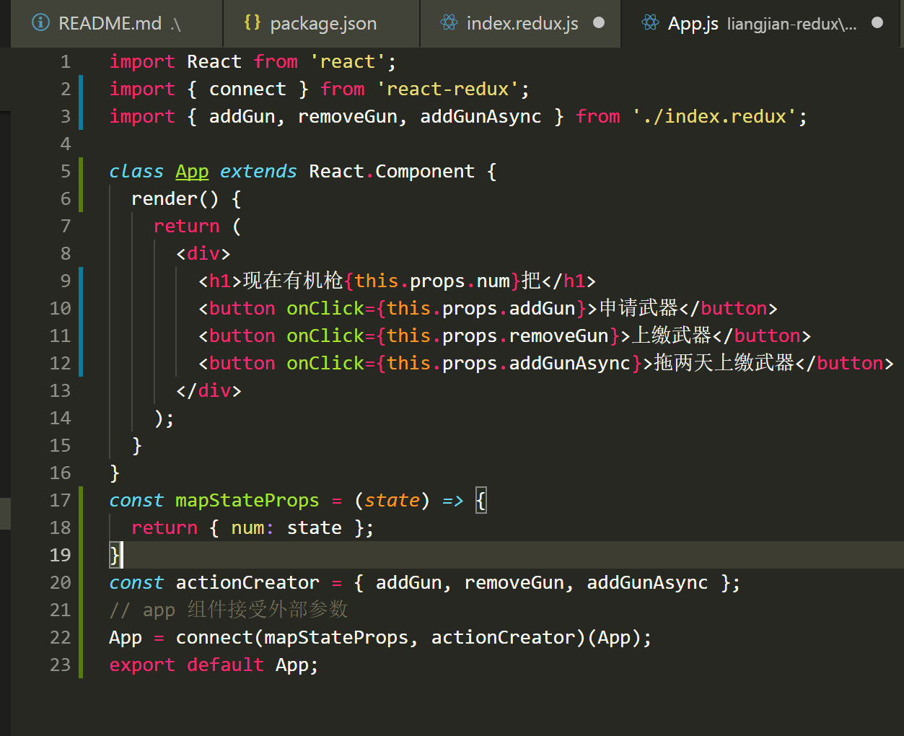

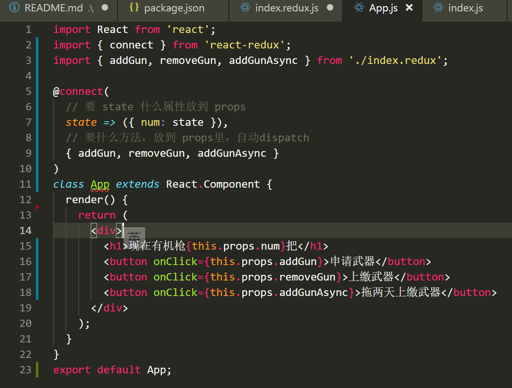

## Redux-router4

- React 官方推荐路由库，4是最新版本
  - Redux-router4 是最新的版本，和之前版本不兼容，浏览器和 RN 均兼容
  - React 开发单页应用必备，碱性路由即组件的该概念
  - 核心概念：
    - 动态路由
    - BrowserRouter: 浏览器路由
    - Route: 路由匹配组件渲染
    - Link: 指定页面跳转地址 to="地址"
    - Switch: 只渲染第一个Route
    - Redirect: 页面跳转到指定位置

### 安装 [react-router](https://reacttraining.com/react-router/)

- `npm i react-router-dom -S`
- **Router4** 使用 `react-router-dom` 作为浏览器的路由
- 忘记 **Router2**  的内容，拥抱最新的 Router4

### 组件

- `BrowserRouter` 包括整个应用
- `Route`r 路由对应渲染的组件，可嵌套
- `Link` 跳转专用

``` js
// 多页应用
import { BrowserRouter, Route, Link, Redirect, Switch } from 'react-router-dom'
import App from './App'
import Yiying from './Yiying'
import Qibinglian from './Qibinglian'
import Test from './Test'
ReactDOM.render(
  (<Provider store={store}>
    <BrowserRouter>
      <nav>
        <ul>
          <li><Link to="/">团部</Link></li>
          <li><Link to="/yiying">一营</Link></li>
          <li><Link to="/qibinglian">骑兵连</Link></li>
        </ul>
        <Switch>
          {/*Switch: 只渲染第一个Route*/}
          <Route path="/" exact component={App}></Route>
          <Route path="/yiying" component={Yiying} boss="张大喵"></Route>
          <Route path="/qibinglian" component={Qibinglian} boss="孙德胜"></Route>
          <Route path="/:location" component={Test}></Route>
          {/*不管访问什么页面都会跳转到首页*/}
          {/* <Redirect to='/'></Redirect> */}
        </Switch>
      </nav>
    </BrowserRouter>
  </Provider>),
  document.getElementById('root')
)
```

- 跳转到 /

``` js
  this.props.history.push('/')
```

### 其他组件

- `url` 参数，`Router` 组件参数可用冒号标识参数
- `Redirect` 组件跳转
  - `<Redirect to="/"></Redirect>`
- `Switch` 只渲染一个子 `Route` 组件

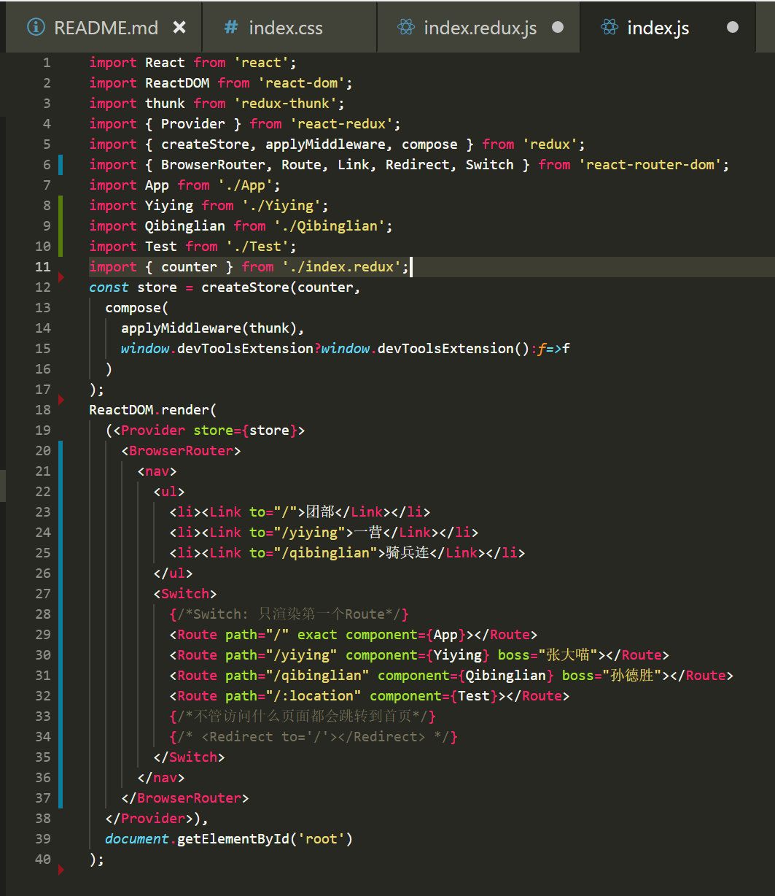

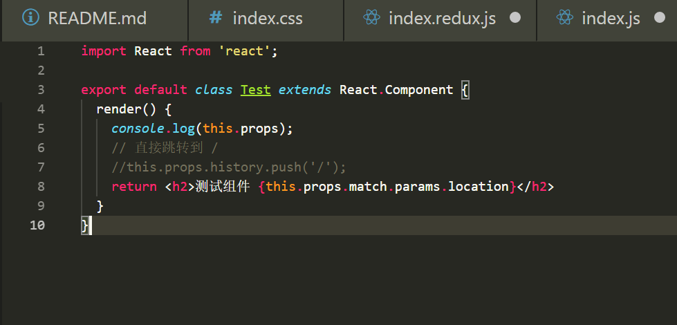

## 前后端联调

### 使用 asios 发送异步请求

- 如何发送,端口不一致,使用 `proxy` 配置转发
- **axios** 拦截器, 统一 loading  处理
- **redux** 里使用异步数据,渲染页面

### axios

> 简洁好用的发送请求库

- 调用接口放在`componentDidMount`生命周期函数
- 安装第三方模块：`npm i axios --save`
- 启动 mongod 服务: `mongod.exe --dbpath C:\usr_local\MongoDB\data --port 9093`

``` js
import axios from 'axios'
componentDidMount() {
  // 调用接口
  axios.get('/api/todolist')
    .then((data)=>{ alert('success');console.log(data); })
    .catch(()=>{ alert('faire')  })
}
```

``` sh
# vim package.json
  {
    "proxy": "http://localhost:9093"
  }
```

Auth.js

``` js
import axios from 'axios'
class Auth extends React.Component {
  constructor() {}
  componentDidMount() {
    axios.get('/data')
      .then(res=>{
        if (res.status == 200) {
          this.setState({
            data: res.data
          })
        }
      })
  }
}
```

## jspm

> Package Manager

- 语言包：npm, github
- Traceur
- Babel
- 发布应用：bundle

- SystemJS 加载 js 模块
  - AMD
  - CommonJS
  - ES6

### setup jspm

- 全局安装：`# npm install jspm -g`
- 创建项目：`# mkdir frontend && cd frontend`
- 初始化项目：`# npm init`
- 安装 jspm : `# npm i jspm --save-dev`
- 配置 jspm : `# jspm init`
  - `config.js` 是jspm 配置文件
  - `jspm_packages` jspm安装的包目录

- jspm会 动态的载入 babel 工具

### jspm install package

- 修改报名位jquery components 是仓库拥有者， jquery 仓库的名字

`# jspm install jquery=github:components/jquery`

- config.js

### jspm uninstall package

`# jspm uninstall jquery`

- https://github.com/jspm/registry 的package.json 有jquery， 通过一下方式安装

- `jspm install jquery` 安装最新的版本
- `jspm install jquery@^2.1.0`
- `jspm install jquery@~2.1.0`

### 使用ES6模块, BrowserSync 使用

1. `npm install -g browser-sync` 安装 Node 后，通过npm安装BrowserSync(自动刷新)

2. 使用BrowserSync： `browser-sync start --server` 开启服务

`browser-sync start --server --no-notify --files 'index.html, app/**/*.js'`

### 打包bundle 功能

``` sh
# jspm bundle app/main app/build.js  将app文件夹下的main.js里面的js都打包到build.js中
# jspm bundle app/main app/build.js --inject 这样不用在html 引入build.js文件
```

### jspm 安装 react

``` sh
# jspm install react
# jspm install react@0.14.0-rc1

# jspm install react-dom
# jspm install semantic-ui
# jspm install css
```

监视服务器文件的变化

``` sh
# browser-sync start --server --no-notify --files 'index.html, app/**/*.js'
```

## bower 包管理

- `# npm install -g bower`
- `# bower install react`

## React 的 CSS 过度动画

[react-transition-group](https://github.com/reactjs/react-transition-group) 第三方模块

`npm install react-transition-group --sav`

动画会移除DOM元素

### 初始化项目

``` js
// 引入包
import React from 'react';
import ReactDOM from 'react-dom';

// all in js (JS引入css文件)
import './index.css';

// 引入自定义组件（自定义组件名开头必须是大写）
import App from './App';

// PWA progressive web application
// https协议的服务器上，第一次访问之后，第二次访问时断网，依赖可以访问之前访问的页面
import registerServiceWorker from './registerServiceWorker';

// App组件挂载到id为root节点上
// <App /> 是JSX语法需要引入react
ReactDOM.render(<App />, document.getElementById('root'));
registerServiceWorker();
```

``` js
import React from 'react';
const Component = React.Component;

import React,{Component} from 'react';
```

使用了**JSX语法**必须引入**react包**

## styled-components 与 reset.css 的结合使用

1. 安装 css模块

`yarn add styled-components`

2. 创建css内容的js文件`style.js`并导入

```js
// styled-components版本4以下
import { injectGlobal } from 'styled-components'
// 全局样式
injectGlobal`
  body {color:red}
`
```

`import ./style.js`

---

``` js
// styled-components版本4以上
import {createGlobalStyle} from 'styled-components'

// 全局样式
export const GlobalStyled = createGlobalStyle`
  body {
    color: red
  }
`
```

``` js
import { GlobalStyled } from './style'
class App extends React.Components{
  render () {
    return (
      <div className='App'>
        <GlobalStyled />
      </div>
    )
  }
}
```
